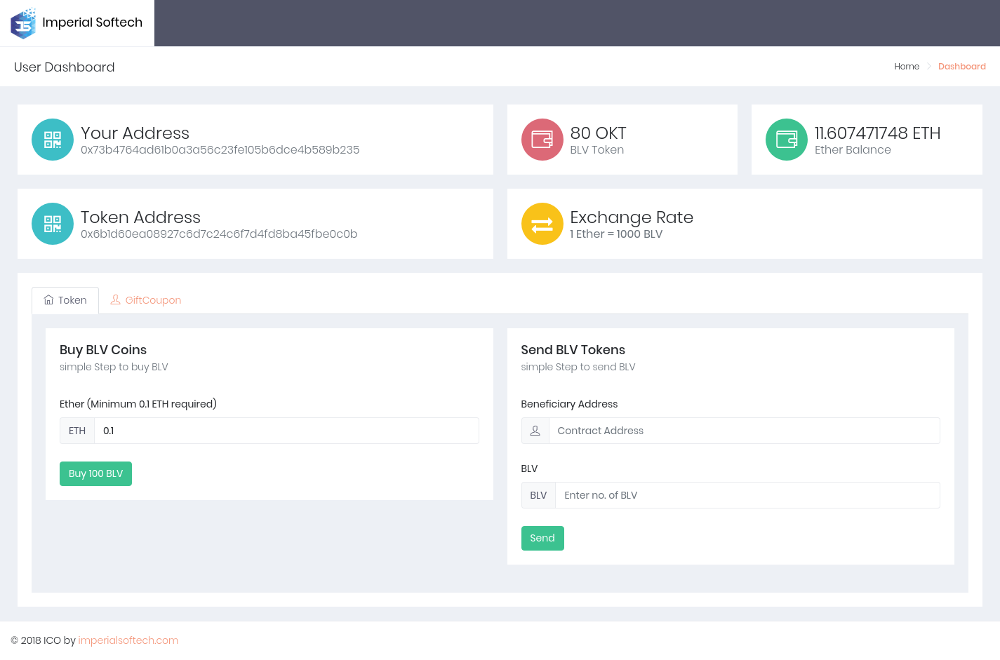
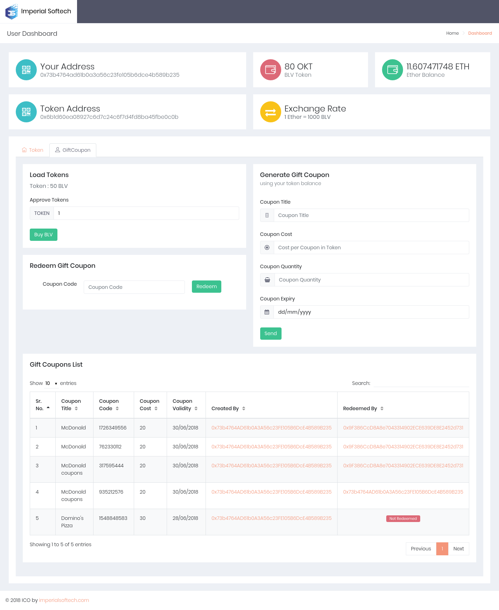

# Implementation of Gift Coupon Creation, Distribution and Coupon Redeem using Ethereum Smart Contract

This Gift Coupon project is a ERC-20 based token Web Application. 

TThe idea is oraganizations can use ERC-20 tokens to reward
others using Gift Coupon. In this project you can Generate Gift Coupons to distribute in people around you. People can also redeem coupon using Coupon's redeem code to receive token in their wallets. 


#### What we are providing?
---

- We have implemented smart contract which provides functionality for generating gift coupons, distributing coupon codes 
and redeeming coupon codes.


#### Included Components
---
- Solidity (Ethereum Smart Contract Language)
- Metamask (Ethereum Browser Wallet)
- Rinkeby Test Network 
- Infura 
- Truffle
- IPFS
- Web3JS
- Apache and PHP

#### Prerequisites
---
- Truffle v4.1.8 (core: 4.1.8) (http://truffleframework.com/docs/getting_started/installation)
- Solidity v0.4.23
- Metamask (https://metamask.io) /Ganache Wallet
> [Please Note : infura.io provider is used for the demo ]

#### Deployment Steps:
---
**Setting up Ethereum Smart Contract:**

```
git clone https://github.com/imperialsoftech/giftcoupon-ethereum
cd giftcoupon-ethereum/
npm install
cp truffle.js.sample truffle.js
```

**Update truffle.js **

```
var HDWalletProvider = require("truffle-hdwallet-provider");
module.exports = 
{
    networks: 
    {
	    rinkeby: {
		    provider: function() {
		      var mnemonic = 'snap call clerk ...'; //put ETH wallet 12 mnemonic code	
		      return new HDWalletProvider(mnemonic, "https://rinkeby.infura.io/<API_KEY_HERE>"); // update your infura rinkeby network API Key
		    },
		    network_id: '4',
		    gas: 6054449,
		    gasPrice: 1000000000
		}  
    }
};
```

**Update 2_deploy.contracts.js **

```
const IcoToken = artifacts.require('IcoToken');
const IcoContract = artifacts.require('IcoContract');
const GiftCoupon = artifacts.require('GiftCoupon');

module.exports = function(deployer){
	deployer.deploy(
			IcoToken,
			'OLA Token',
			'OLAT',
			'18',
			'1.0'
		).then(() => {

			return deployer.deploy(
					IcoContract,
					'0x9F386CcD8A8e7043......', //put Your Wallet Address from which all contracts will be deployed
					IcoToken.address,
					'100000000000000000000000000', // 100000000 Token
				    '1000', // 1 ETH = 1000 Token
				    '1514764800', // 01/01/2018
				    '1546214400', // 31/12/2018
				    '100000000000000000' // 0.1 ETH
				)
		}).then(() => 
		{	
			return IcoToken.deployed();	
		}).then(function(instance){

			instance.setIcoContract(IcoContract.address);
			return deployer.deploy(
					GiftCoupon,
					IcoToken.address					
				);	
		});
};
```


Go to your project folder in terminal then execute :

```
truffle compile 
truffle migrate --network rinkeby
```

---
**Setting up UI:**

- Navigate to Apache Document Root in terminal
```
git clone https://github.com/imperialsoftech/giftcoupon-ui
cd giftcoupon-ui/
```
- Open http://<URL>/giftcoupon-ui


#### Development Screen's
---
#### Token Activities
---


- Get MetaMask - You can go for this option if you don't have metamask wallet in your chrome or firefox browser and create your own ethereum wallet
- In Send BLV Tokens user can send BLV tokens to other Contract Address or Ethereum Wallet Address 

#### Gift Coupon Activities
---


- In Gift Coupon Tab Load Tokens Section User have to approve tokens from current user account to use for generating Gift Coupons. 

- In Generate Gift Coupons section user can generate gift coupons proving title of coupon, cost per coupon in tokens, coupon
quantity to be generated and coupon expiry date. 

- User can check out the list of newly created coupons in Gift Coupon List table. In table user can also find out the Coupon codes which user can distribute in around people.

- In Redeem Gift Coupon section use can redeem cost of coupon in token providing coupon codes. After redeeming coupon code user can see increased token balance in Token Balance Section on user dashboard.